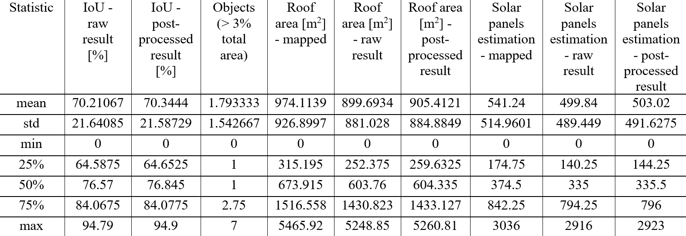

# Rooftops Segmentation for Solar Panels Estimation Project

## Table of Contents

1. [Introduction](#introduction)
2. [Usage](#usage)
   - [Environment Setup](#environment-setup)
   - [Running the Code](#running-the-code)
3. [Preprocessing](#preprocessing)
4. [Segmentation](#segmentation)
5. [Post-processing](#post-processing)
6. [Spark Integration](#spark-integration)
7. [Results](#results)
8. [License](#license)

## Introduction

This project aims to detect and segment rooftops using various image processing and machine learning techniques all with goal to provide calculation of possible number of solar panel which could be installed on them. 
Project is made as part of a master’s studies in the AI ​​& ML master’s program at the University of Novi Sad.

## Usage
### Environment Setup

This project uses a conda environment named `roofs_segmentation`. To set up the environment, follow these steps:

1. Clone the repository:
    ```bash
    git clone https://github.com/IgMann/rooftops-segmentation-solar-panels-estimation-project.git
    cd rooftops-segmentation-solar-panels-estimation-project
    ```

2. Create the conda environment:
    ```bash
    conda create --name roofs_segmentation python=3.8
    ```

3. Activate the conda environment:
    ```bash
    conda activate roofs_segmentation
    ```

### Running the Code

To run preprocessing code scripts, use following command:
```bash
python script_name.py
```
or preferred IDE/Code Editor. 

To run the Jupyter notebook, use the following command:
```bash
jupyter notebook main.ipynb
```

## Preprocessing

The dataset used in this project was formed based on three satellite images of terrain captured in a rural area near Subotica. The images are as follows:
1. Standard color image (RGB image);
2. Digital Elevation Model (DEM image);
3. Digital Surface Model (DSM image).

All three images represent the same terrain and have dimensions of 24000x27000 pixels. The images were originally in TIFF (Tagged Image File Format) before being converted to PNG (Portable Network Graphics) format for easier visualization.

As a prerequisite for creating an appropriate dataset suitable for training and evaluating machine learning models, it was necessary to first create an appropriate mask with labels representing building roofs. The mask creation process was as follows:

1. First, a normalized DSM image (nDSM) was formed by subtracting the DEM image from the DSM image and subsequent binarization. The resulting image showed objects and their locations quite accurately, but since it couldn't display low objects or distinguish trees from buildings, it couldn't be used as a mask. Instead, it was used as an aid in labeling for easier object localization.

2. Then, the RGB and nDSM images were decomposed, or divided into a 4x4 grid consisting of 16 smaller images with dimensions of 6000x6750 pixels. This was done for easier orientation and labeling.

3. The newly created RGB images were then loaded into Label Studio where they were labeled one by one, while the nDSM images were used in parallel as an aid for easier object localization. In this way, a total of 1468 objects were labeled over a period of 3 weeks.

4. The labels were then exported in COCO (Common Objects in Context) format and reconstructed into PNG images for easier manipulation.

5. These images were then assembled into a single PNG image representing the mask of all mapped objects, with dimensions of 24000x27000 pixels.

After obtaining the mask, the further process was quite simple. The images (RGB, DEM, DSM, as well as the mask) were then divided into equidistant pieces, called patches, with dimensions of 250x250 pixels. This resulted in 10,368 images, or groups of images, as each patch contained RGB, DEM, DSM images, as well as a mask with labels. However, the vast majority of images did not contain roofs, but rather agricultural areas, since it was a rural environment. If model training were to proceed directly with these images, it would lead to significant problems due to class imbalance. For this reason, the dataset was "cleaned" by deleting all images that did not contain roofs. This resulted in a final set of 749 images, or groups of images, which were further used in the project.

## Segmentation

1. The dataset was loaded and divided into two groups: a training group (80% or 599 groups of images) and a test group (20% or 150 groups of images). The choice of the ratio between training and test dataset sizes was made according to the Pareto principle.

2. Then, a Convolutional Autoencoder model was initialized. The input tensors were five-channel images (three RGB channels, DEM and DSM channels), while the output to be reconstructed was a single-channel binarized mask.

3. The resulting model was then trained for 200 epochs using IoU (Intersection over Union) as the target metric.

4. The 57th epoch proved to be the best, with an IoU result of 0.7730. The weights from this epoch were used in subsequent steps.

5. The entire experiment was monitored using TensorBoard, where logs from each epoch were stored and visualized.

## Post-processing

1. After reloading weights from the 57th epoch, the model was applied to 150 images from the test set while preserving them for better visualization.

2. The resulting images were then processed using digital image processing methods to reduce artifacts. First, they were passed through a conditional median filter, conditioned to work only on "salt and pepper" noise. This was followed by erosion and then dilation of the image.

3. After digital image processing, objects were identified in both the raw images obtained directly from the network and those processed afterwards. The area of these objects was then determined, both from a bird's eye view and at an angle. Next, the number of solar panels that could be installed on this area was calculated, taking into account that the area of one solar panel was estimated at 1.65 square meters, and 90% was taken as the percentage of roof usability.

4. The results obtained for each image were then stored and statistically analyzed using Python's pandas library.

## Spark Integration

The project also includes a version that integrates Apache Spark for distributed processing. The main differences in the Spark version are:

1. Spark is used for data preprocessing and structuring. The image data is loaded into a Spark DataFrame, and transformations are applied using Spark SQL and UDFs (User-Defined Functions).

2. During training and evaluation, Spark is used to calculate the AUC-ROC metric. The model predictions and ground truth masks are collected and converted into a Spark DataFrame, and the "BinaryClassificationEvaluator" is used to calculate the AUC-ROC.

3. In the post-processing step, Spark is used to parallelize the processing of result images and the calculation of various metrics such as IoU, object counts, roof areas, and solar panel estimations. The results are collected into a Spark DataFrame and saved as a CSV file.

The Spark integration allows for distributed processing of the data and can handle larger datasets more efficiently compared to the non-Spark version.

## Results

Results are shown in this table:


## License

This project is licensed under the MIT License. See the [LICENSE](./LICENSE) file for more details.